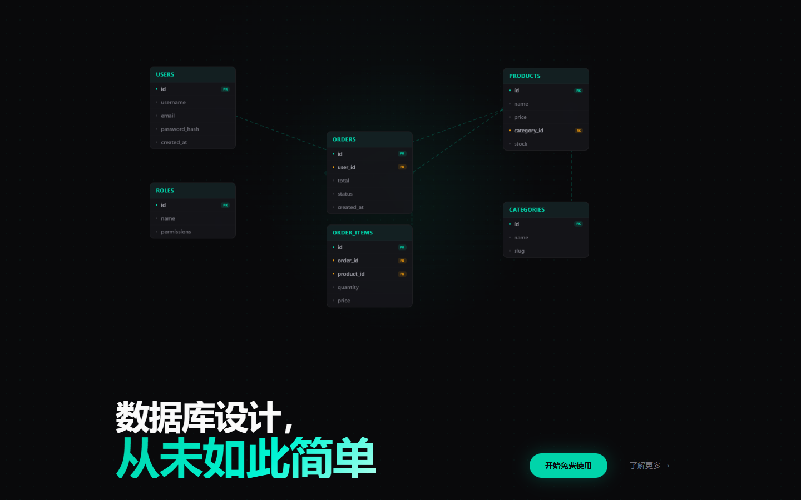
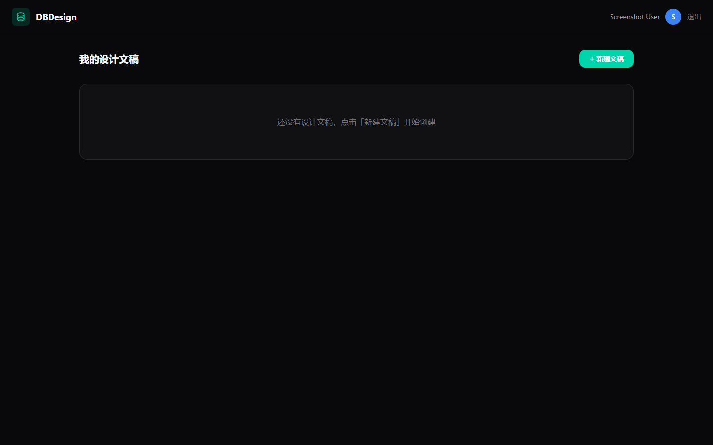
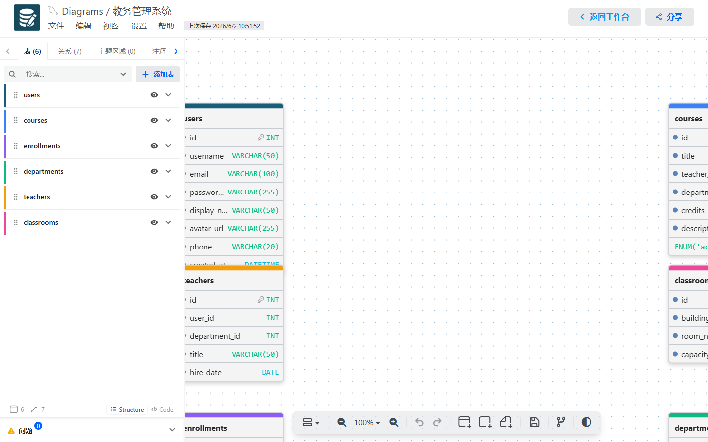

<p align="center">
  <a href="README.md">🇨🇳 中文</a> · <a href="README.en.md">🇬🇧 English</a>
</p>

# DBDesign — Collaborative Online Database Design Tool

A web application for real-time collaborative ER diagram editing, based on [DrawDB](https://github.com/drawdb-io/drawdb).

<p align="center">
  
  <br/>
  
  
</p>

## Tech Stack

| Layer | Technology |
|---|---|
| Frontend | React 18 + Vite 6 + Semi UI + Tailwind CSS |
| Backend | Express + Socket.IO + JWT |
| Database | SQLite (sql.js, in-memory with file persistence) |
| Collaboration | OT merge engine + real-time awareness (cursor/selection) |

## Getting Started

```bash
# Install dependencies
cd server && npm install
cd ../client && npm install
cd ..

# Development (both frontend + backend)
npm run dev          # Frontend :5173 + Backend :3001
npm run dev:server   # Backend only
npm run dev:client   # Frontend only

# Production build
npm run build && npm start   # Single port 3001 (server-served frontend)
```

## Docker Deployment

```bash
# Build and start
docker compose up -d

# Custom JWT secret
JWT_SECRET=your-secret-key docker compose up -d

# View logs
docker compose logs -f
```

Listens on `0.0.0.0:3001`. Database persisted in named volume `dbdesign-data`.

## Project Structure

```
dbdesign/
├── client/          # Frontend (React)
│   └── src/
│       ├── api/          # API clients
│       ├── components/   # UI components
│       ├── context/      # React Context
│       ├── hooks/        # Custom hooks
│       └── pages/        # Pages (Dashboard, Editor, Login, etc.)
├── server/          # Backend (Express)
│   └── src/
│       ├── collab/       # Socket.IO collaboration engine
│       ├── db/           # SQLite init + migrations
│       ├── middleware/   # JWT auth middleware
│       ├── models/       # Data models
│       └── routes/       # API routes
└── docs/            # Design documents
```

## Features

- **Authentication** — Register / Login / JWT tokens
- **Diagram Management** — Create / Edit / Delete database design diagrams
- **Real-time Collaboration** — Multiple users editing the same ER diagram simultaneously
- **Cursor Awareness** — See collaborators' cursor positions on the canvas in real time
- **Selection Highlight** — Dashed border on tables selected by collaborators
- **Conflict Detection** — Toast warning when two users edit the same entity simultaneously
- **Online User List** — Toolbar showing current online collaborators and which table they are editing

## Key Decisions

- Uses **sql.js** (pure JS SQLite) instead of `better-sqlite3` — no native compilation needed
- Calls `saveDbToDisk()` after every write operation, persists to `server/data/dbdesign.db`
- Collaboration uses **Operational Transformation (OT)** for delta merging, no CRDT
- Socket.IO transport forced to `websocket` only, bypassing Vite proxy long-polling issues

## Development Progress

See [`开发进度.md`](开发进度.md) (Chinese).


